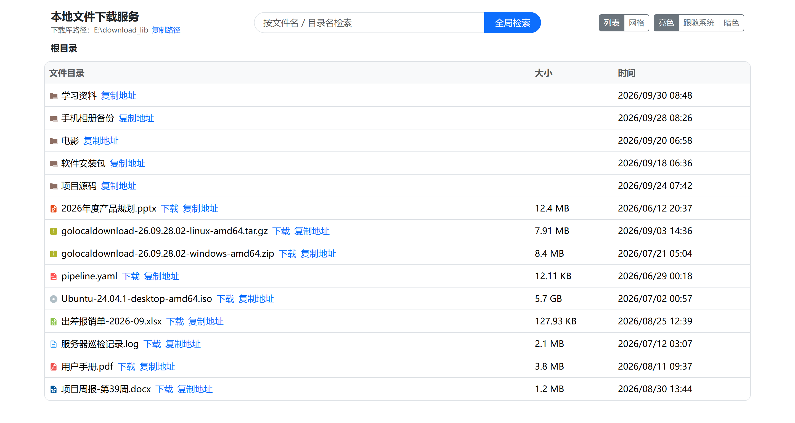
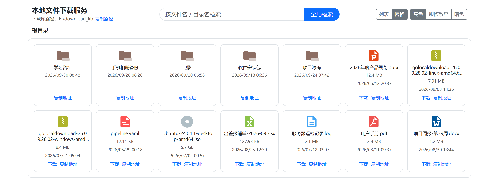
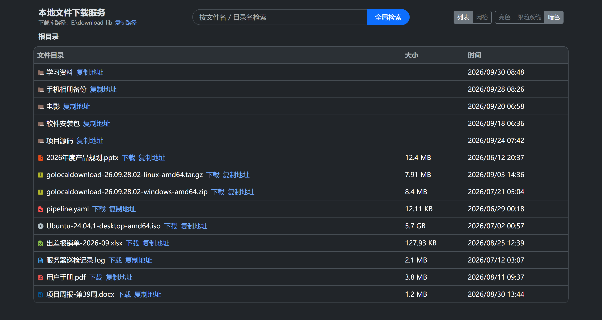
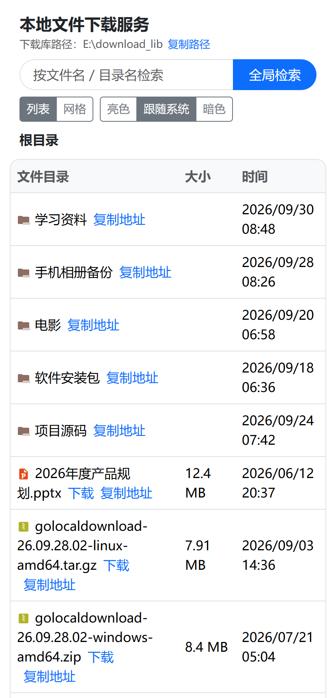
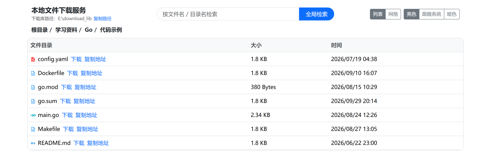
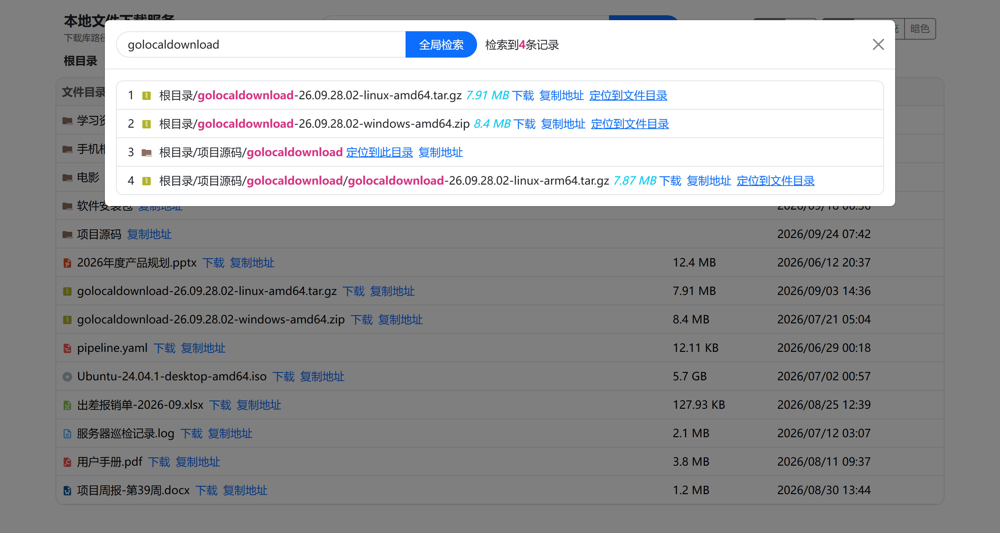
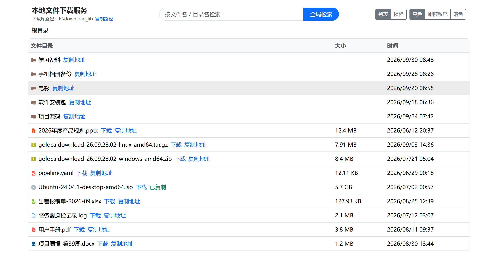

[简体中文](README.md) · English

# golocaldownload · Local File Download Service

[](https://github.com/kite88/golocaldownload/releases/latest)
[](LICENSE)

A local file download service written in Go + Gin: point it at a directory on your server to
use as the "download library", then browse directories, search file names globally, and download
files right from the browser. Page templates and static assets are all embedded into the binary,
so a release is a single executable — configuration defaults are embedded too, which means
**unpack and run**.

| Repo    | URL                                        |
| ------- | ------------------------------------------ |
| GitHub  | https://github.com/kite88/golocaldownload  |
| GitCode | https://gitcode.com/kite88/golocaldownload |
| Gitee   | https://gitee.com/kite88/golocaldownload   |

## Screenshots

> Captured from a real `go run .` session with the download library pointed at `E:\download_lib`;
> the path under the title is exactly that directory (inside a container it shows the mapped
> host directory instead).

| List view: directories first, with size and modification time | Grid view: icons chosen by extension |
| :--: | :--: |
|  |  |

| Dark theme: light / follow system / dark | Narrow screens: stacks vertically in a phone browser |
| :--: | :--: |
|  |  |

## Features

- **Directory browsing**: navigate level by level with breadcrumbs; directories sort before
  files, with size and modification time displayed.
- **Type-based icons**: archives / images / videos / audio / documents / spreadsheets / code
  etc. get different icons based on file extension (icons from Material Icon Theme, MIT, see
  `web/static/icon/material/LICENSE.txt`); unknown extensions fall back to a generic document icon.
- **Global search**: case-insensitive substring matching on file names, with one-click jump
  to the directory containing the file.
- **File download**: non-ASCII file names (Chinese, spaces, etc.) are encoded per RFC 5987,
  so browsers never save them with garbled names.
- **One-click copy links**: files copy as ready-to-use absolute download URLs (browsers,
  `wget`, and download managers all work directly); directories copy the page URL pointing to
  that directory (generated according to how you're currently accessing — localhost or LAN IP).
  "Copy path" below the title copies the absolute path of the download library itself
  (inside a container this is the mapped directory on the host). The link briefly shows
  "Copied" after copying.
- **Theme switching**: light / follow system / dark, with the choice stored in the browser;
  the theme is applied on first paint so there's no white flash in dark mode.
- **List / grid views**: the list view suits checking sizes and times, the grid view suits
  recognizing content by icons (images, archives, etc.); toggle with one click in the top-right
  corner, and the choice is stored in the browser as well. Both views share the same data, so
  switching never re-requests the API.
- **Path traversal protection**: listing, searching, and downloading only allow paths inside
  the download library; directory-traversal attempts like `../` are rejected outright.
- **Single-file delivery**: page templates, static assets, and config templates are all
  embedded; no external files needed at runtime.
- **Graceful shutdown**: `Ctrl+C` or `SIGTERM` waits for in-flight downloads to finish before
  exiting, so large transfers never get cut off.

## Feature Walkthrough

### 1. Directory browsing and breadcrumbs

Click a directory name to descend; the breadcrumb expands level by level and any level can be
jumped back to directly. Directories sort before files, and the list and grid views share one
dataset — switching only re-renders, it never re-requests the API.



### 2. Global search

Case-insensitive substring matching on file / directory names (500 results max), with both the
matched keyword and the full path highlighted. Every result offers "Download" and "Copy link"
directly, plus "Go to this directory" for directories and "Go to the containing directory" for
files, so you can jump to the right level in one click.



### 3. Downloading and one-click copy

"Download" uses the browser's native download; "Copy link" copies a ready-to-use absolute URL
(`http://<host>:9801/api/download?data=...`) that works when pasted into a browser, `wget`, or a
download manager, while directories copy the page URL pointing to that directory. After copying,
the link briefly turns into a green "Copied".



## Project Layout

```text
.
├── main.go                 Entry point: wires config, router, graceful shutdown
├── config/                 Config loading (embedded env.ini.<env> templates + external env.ini override)
├── common/                 Utilities: directory prep, safe path resolution, size formatting
├── handle/                 The three handlers: list / search / download
├── router/                 Route assembly: pages, static assets, API group
├── test/                   In-process router integration tests
├── web/
│   ├── view/index.html     Page template (embedded)
│   └── static/             Bootstrap / jQuery / icons / frontend scripts (embedded)
├── tools/pack/             Archiver: makes zip and tar.gz reproducible (invoked by build scripts)
├── start.bat / start.sh    Launchers: sit next to the binary, double-click / ./ to run (shipped in the archives)
├── build.ps1 / build.sh    Cross-compile all platforms
├── Dockerfile              Two-stage minimal image build
└── .github/workflows/      Release flow: checks/tests → cross-compile & Release → push multi-arch images
```

## Quick Start

Requires Go 1.23 or later.

```bash
# Run directly in dev mode
go run .

# Or build then run
go build -o golocaldownload . && ./golocaldownload
```

On startup it prints the version, config source, download library directory, and accessible
URLs — visit any of them:

```text
2026-09-28 10:00:00 golocaldownload dev (debug)
Config source: config/env.ini
Download library: E:\download_lib
Local access: http://127.0.0.1:9801
LAN access: http://192.168.1.10:9801
```

Drop the files you want to serve into the download library directory and refresh the page.

### Command-line Flags

| Flag | Default | Description |
| --- | --- | --- |
| `-config` | empty | Path to an external config file (INI); when empty, auto-discovery applies per the priority list below |
| `-version` | `false` | Print the version and exit |

### Configuration

The config file is INI format (`config/env.ini.<env>` are the templates in the repo):

| Key | Default | Description |
| --- | --- | --- |
| `env_mode` | `release` | Run mode: `debug` / `release` / `test`; invalid values fall back to `release` |
| `download_lib_path` | `download_lib` | Download library directory; relative or absolute paths, multi-level directories are created automatically; empty means the program's current working directory |
| `display_lib_path` | empty | Download library path shown on the page; when empty, the container-mapped host directory is auto-detected (see the "Mount paths" section), falling back to the real path if undetectable |
| `server.protocol` | `http` | Only used to build the access URLs in startup logs; does not change actual listening behavior |
| `server.http_port` | `9801` | Listening port |

Config sources, highest to lowest priority:

1. The file specified by the `-config` flag / `GLD_CONFIG` env var (must exist if specified);
2. `env.ini` in the working directory;
3. `config/env.ini` in the working directory;
4. The embedded `env.ini.<GLD_ENV>` in the binary (`GLD_ENV` defaults to `release`);
5. The embedded `env.ini.release` in the binary.

> Compared with the old version, `download_lib_path` now accepts multi-level paths like
> `./a/b` (created level by level), and you **no longer need** to rename `env.ini.local` to
> `env.ini` just to compile: embedded templates are used by default, so a fresh clone builds
> with plain `go build`.

## Cross-Compilation

```powershell
.\build.ps1                      # Windows (PowerShell 5.1 / 7)
.\build.ps1 -OutDir D:\tmp\dist  # Different output directory
```

```bash
./build.sh                       # macOS / Linux
./build.sh -o /tmp/gld-dist      # Different output directory
```

The target matrix lives at the top of both scripts — add or remove a line to change it.
Default coverage:

| OS | Architectures |
| --- | --- |
| Windows | amd64 / arm64 / 386 |
| Linux | amd64 / arm64 / 386 / arm(v7) / ppc64le / s390x / riscv64 / loong64 |
| macOS | amd64 / arm64 |
| FreeBSD | amd64 / arm64 |

Both scripts run the same target matrix and call the same packing tool, so artifacts are
**byte-for-byte identical** (same checksums). Output goes to `dist/` by default (gitignored).
Following common convention, Windows gets zip archives and other platforms get `.tar.gz`
(zip doesn't preserve the Unix executable bit; only tar.gz lets Linux / macOS users run the
binary right after extracting):

```text
dist/
├── golocaldownload-windows-amd64.zip    →  golocaldownload.exe + start.bat
├── golocaldownload-linux-arm64.tar.gz   →  golocaldownload + start.sh (both 0755)
├── ……                                    (15 platforms in total)
├── golocaldownload(.exe)                ← uncompressed binary for the host platform, for local use only, not published
└── checksums.txt                        ← SHA256 of the 15 archives (LF line endings, works with sha256sum -c)
```

Archived executables are versioned (from `git describe`; `dev` outside a git environment) —
check with `golocaldownload -version`. Every archive also carries a launcher (`start.bat` on
Windows, `start.sh` elsewhere): unpack and double-click / run it, and every argument is passed
straight through to the program, e.g. `start.bat -config .\env.ini` or
`./start.sh -config /etc/gld/env.ini`.

> Archives are produced by `tools/pack` rather than system `tar` / `zip`: Windows' bundled
> `tar.exe` (a stripped-down bsdtar) ignores Unix permission bits and doesn't support `--mode`,
> so its archives extract as 644 on Linux and won't run; `zip(1)` isn't guaranteed to exist on
> macOS / Linux, and implementations write inconsistent bytes. `pack` uses the Go standard
> library to explicitly write 0755 and fixes timestamps, so archives and checksums are
> reproducible from the same source on any platform with either script; extra files such as
> the launchers go into the same archive via `-add` (`name-inside-archive=source-path`,
> repeatable).

### Releasing

Push a `v*` tag or a date-based tag (e.g. `26.09.28.03`, following the `YY.MM.DD.NN`
convention) and the workflow (`.github/workflows/release.yml`) does three things automatically:

1. **Checks & tests**: `go vet ./...`, `go test ./...`;
2. **Create Release**: cross-compile all platforms, self-verify artifacts with
   `sha256sum -c checksums.txt`, then create the GitHub Release;
3. **Push images**: build linux/amd64 + linux/arm64 multi-arch images and push them to Docker
   Hub and Alibaba Cloud Container Registry.

```bash
git tag 26.09.28.03 && git push origin 26.09.28.03
```

A failure at any step aborts the release. Tags containing `-` (e.g. `26.09.28.03-rc1`) are
marked as prereleases and **will not overwrite the `latest` image tag**.

#### Image push requires 4 Secrets

Repo → **Settings → Secrets and variables → Actions** (direct link:
`https://github.com/kite88/golocaldownload/settings/secrets/actions`):

| Secret | Where the value comes from |
| --- | --- |
| `DOCKERHUB_USERNAME` | Your Docker Hub **login username** (not the display name, not an email) |
| `DOCKERHUB_TOKEN` | A Docker Hub **Access Token** with **Repo Read & Write** scope; password login is deprecated by Docker Hub |
| `ALIYUN_REGISTRY_USERNAME` | The login username shown on the "Access Credentials" page of the Alibaba Cloud ACR console |
| `ALIYUN_REGISTRY_PASSWORD` | The **fixed Registry password** set on that same page (not your Alibaba Cloud account password, not an AccessKey) |

The two registries are **independent switches**: configuring just one pair works, and the
missing pair only logs a `::notice::` skip; if neither pair is configured the image job skips
entirely with a warning, without affecting Release creation.

Image addresses live in the workflow's `env:` — change these two lines when switching
accounts / regions:

```yaml
ALIYUN_REGISTRY: registry.cn-shenzhen.aliyuncs.com
ALIYUN_IMAGE: registry.cn-shenzhen.aliyuncs.com/tutudev99/golocaldownload
```

> Image builds **explicitly disable `provenance` / `sbom`**: Alibaba Cloud ACR Personal
> Edition doesn't recognize the attestation manifests generated by BuildKit
> (`application/vnd.oci.empty.v1+json`), and leaving them on fails with
> `denied: unknown manifest class`, blocking the whole push. Re-enabling requires splitting
> into two builds pushing to the two registries separately.

## Deployment

> How to choose: for code changes / long-term maintenance use **Option 1**; to just run the
> program use **Option 2**; with Docker available use **Option 3** (local build) or
> **Option 4** (compose); to just pull a prebuilt image use **Option 5** (Docker Hub) or
> **Option 6** (Alibaba Cloud).

### How to Write Mount Paths (applies to all Docker options)

For the `-v <host dir>:/root/download_lib` in every Docker option, the **right side must
always be `/root/download_lib`** (the download library in the embedded config is a relative
path based on the container working directory `/root/`); fill in the left side per your host OS:

| Host | Left side | Where files actually live |
| --- | --- | --- |
| Linux | `-v /home/download_lib:/root/download_lib` | `/home/download_lib` |
| Windows + Docker Desktop | `-v D:/download_lib:/root/download_lib` | `D:\download_lib` (visible in Explorer) |
| macOS + Docker Desktop | `-v /Users/<your user>/download_lib:/root/download_lib` | that directory |

Two extra pitfalls on Windows:

- **Don't use Linux-style paths.** `-v /home/download_lib:...` is treated as a path **inside**
  Docker Desktop's WSL2 VM: the container still runs, but the data isn't on Windows, is
  invisible to Explorer, and gets wiped by Docker Desktop's "Reset to factory defaults".
  For a Windows directory use a drive-letter path — **forward slashes are the most reliable**.
- **Git Bash rewrites paths.** MSYS converts `/home/download_lib` into
  `<Git install dir>/home/download_lib`; write `//home/download_lib` instead or set
  `MSYS_NO_PATHCONV=1`; using `D:/download_lib` directly also sidesteps this.

The "download library path" shown on the page is the **directory on the host**, not the
container path: at startup the program reads `/proc/self/mountinfo`, finds the bind mount
record whose mount point is the longest prefix of the library path, and uses its source
directory as the display path (Windows' Docker Desktop also recovers the drive letter from
the superblock option `path=C:\`). With named volumes, or when detection fails, it falls back
to the real path inside the container; to pin a fixed value, set `display_lib_path`.
Both paths are printed in the startup log for comparison:

```text
Download library: /root/download_lib
Host directory: D:\download_lib
```

A missing directory is created automatically (Docker creates the host directory, and the
program runs `MkdirAll` at startup as a fallback). Verifying the mount works is easy:

```bash
docker exec <container> ls -l /root/download_lib   # as seen inside the container
dir D:\download_lib                                # as seen on the Windows host — the two should match
```

### Option 1: Local Source Deployment / Secondary Development

Pick this when you want to modify code, run the latest version, or simply avoid containers.
The only prerequisite is **Go 1.23 or later**.

**1. Clone the code**

```bash
git clone https://github.com/kite88/golocaldownload.git
cd golocaldownload
```

> The GitCode / Gitee repos in the table above are mirrors synced via platform-side pull
> mirroring and may lag behind; for the latest code use GitHub (default branch `main`).

**2. Build**

```bash
go build -o golocaldownload .          # Linux / macOS
```

```powershell
go build -o golocaldownload.exe .      # Windows (PowerShell)
```

The artifact is a **single executable**: page templates, static assets, and config templates
are all embedded — copy it to any machine of the same architecture and it runs as-is.
By default it carries no version (`-version` shows `dev`); add one yourself if desired:

```bash
go build -trimpath -ldflags "-X main.version=26.09.28.02" -o golocaldownload .
```

**3. Run**

```bash
./golocaldownload                      # Linux / macOS
```

```powershell
.\golocaldownload.exe                  # Windows
```

For development, `go run .` is more convenient (compiles to a temp directory and runs
immediately, producing no artifacts — rerun after code changes). It listens on `9801` by
default, and the download library is `download_lib/` under the working directory (created
automatically if missing): drop files in and refresh the page. The startup log prints the
version, config source, download library directory, and actually accessible URLs (local +
LAN); `Ctrl+C` waits for in-flight downloads to finish before exiting.

The build output lands in the repository root, where the `start.bat` / `start.sh` next to it can
be used directly (double-click / `./start.sh`) — same usage as the copy inside the archives.

**4. Configuration**

Four approaches — pick whichever you prefer (priority as in "Config sources" above):

- **① Copy the template**: copy it to `config/env.ini`; that file is gitignored, so edits
  won't pollute the repo;
- **② `-config` flag**: point directly at a template file without touching anything in the repo;
- **③ `GLD_ENV` to pick an embedded template**: values are `debug` / `local` / `release` / `test`;
- **④ `GLD_CONFIG` env var**: equivalent to `-config`, suited for containers / systemd where
  command-line args are inconvenient.

**Linux / macOS**

```bash
cp config/env.ini.local config/env.ini    # ①
go run . -config config/env.ini.local     # ②
GLD_ENV=local go run .                    # ③

GLD_CONFIG=/etc/golocaldownload/env.ini go run .   # ④
```

**Windows (PowerShell)**

```powershell
Copy-Item config\env.ini.local config\env.ini      # ①
go run . -config config\env.ini.local              # ②
$env:GLD_ENV = 'local'; go run .                   # ③

$env:GLD_CONFIG = 'D:\gld\env.ini'; go run .       # ④
```

> If you've already built, there's no need for `go run .` — use `./golocaldownload`
> (`.\golocaldownload.exe` on Windows) instead; under `cmd.exe` the env-var lines become
> `set GLD_ENV=local`, and you must set it and run the command **in the same window**.

**5. Notes after code changes**

- Pages and static assets under `web/` are baked into the binary via `//go:embed`, so you
  **must re-run `go build` or restart `go run .`** after changes — refreshing the browser
  alone won't take effect;
- After changes, run `go test ./...` (the traversal cases in `test/router_test.go` are the
  security regression tests); see the "Development" section below.

To get archives for all platforms in one go, use `./build.sh` or `.\build.ps1`
(see "Cross-Compilation" above).

### Option 2: Run the Executable on a Local Host

Download the archive for your platform from
[Releases](https://github.com/kite88/golocaldownload/releases/latest)
(`.zip` for Windows, `.tar.gz` for Linux / macOS / FreeBSD) and extract it:

- **Windows**: double-click `start.bat` (equivalent to running `golocaldownload.exe` directly).
  The window stays open after the program exits so the exit code is readable — press any key to
  close it; set `GLD_NO_PAUSE=1` beforehand to skip that when calling it from another script.
- **Linux / macOS / FreeBSD**: run `./start.sh` (it lives next to the binary; the exec bit is
  already set inside the archive).

Both launchers only start the program in the foreground and pass arguments straight through, so
`start.bat -config .\env.ini` is equivalent to `golocaldownload.exe -config .\env.ini`. To change
the port or download library directory, drop an `env.ini` in the same directory (templates in
`config/env.ini.*`).

### Option 3: Docker Deployment (Build Image Locally)

First, build the image (same command on all three platforms):

```bash
docker build -t golocaldownload:latest .
```

Then pick the run command for your host OS. **The three commands differ only in the left side
of `-v` (the host directory)**; the right side must always be `/root/download_lib`:

**Linux**

```bash
docker run -p 9801:9801 -v /home/download_lib:/root/download_lib --restart always --name golocaldownload-app -d golocaldownload:latest
```

**Windows (Docker Desktop)**

```powershell
docker run -p 9801:9801 -v D:/download_lib:/root/download_lib --restart always --name golocaldownload-app -d golocaldownload:latest
```

**macOS (Docker Desktop)**

```bash
docker run -p 9801:9801 -v /Users/<your user>/download_lib:/root/download_lib --restart always --name golocaldownload-app -d golocaldownload:latest
```

Flag notes:

- `-p 9801:9801`: host port 9801 → container port 9801;
- `-v <host dir>:/root/download_lib`: the download library mount — details and the two
  Windows pitfalls are in the "Mount paths" section above;
- `--restart always`: auto-restart after the container exits; `-d`: run in background.

You can inject a version number at build time (only affects `golocaldownload -version`
output inside the container):

```bash
docker build --build-arg GLD_VERSION=26.09.28.02 -t golocaldownload:latest .
```

### Option 4: docker-compose Deployment

```bash
docker compose up -d      # older docker-compose command: docker-compose up -d
```

Change the port and download library directory in `docker-compose.yml`. It defaults to
`/home/download_lib` (Linux-style); **on Windows switch to a drive-letter path**, e.g.
`D:/download_lib:/root/download_lib`.

### Option 5: Pull the Prebuilt Image from Docker Hub

```bash
docker pull tutudev99/golocaldownload:latest
docker run -p 9801:9801 --name golocaldownload -v /home/download_lib:/root/download_lib --restart always -d tutudev99/golocaldownload:latest
```

### Option 6: Pull the Prebuilt Image from Alibaba Cloud Container Registry

```bash
docker pull registry.cn-shenzhen.aliyuncs.com/tutudev99/golocaldownload:latest
docker run -p 9801:9801 --name golocaldownload -v /home/download_lib:/root/download_lib --restart always -d registry.cn-shenzhen.aliyuncs.com/tutudev99/golocaldownload:latest
```

> On Windows / macOS hosts, replace the left side of `-v` with your own directory
> (see the "Mount paths" section above).
>
> Both registries receive two tags from the release flow automatically: `latest` and the
> specific version (e.g. `26.09.28.02`), with images covering both linux/amd64 and
> linux/arm64, so ARM servers and Apple Silicon run them directly. To pin a version and avoid
> `latest` drifting with releases, replace `:latest` with a specific version.

## API

| Method & Path | Parameters | Description |
| --- | --- | --- |
| `GET /` | - | The page |
| `GET /api/list` | `path` (path relative to the download library, e.g. `/sub`, empty for the root) | List directory contents |
| `POST /api/search` | form field `keyword` | Search by file name, at most 500 results |
| `GET /api/download` | `data` (base64url-encoded file path) | Download a file |

On error it returns the corresponding status code with `{"error": "..."}`: path traversal
`400` / `403`, missing target `404`, unreadable directory `403`, other internal errors `500`.

Response of `GET /api/list`:

```json
{
  "root_dir": "/data/download_lib",
  "absolute_dir": "/data/download_lib/sub",
  "relative_dirs": [{"": ""}, {"sub": "/sub"}],
  "list": [
    {
      "name": "a.zip",
      "is_dir": false,
      "size": 1.5,
      "size_unit": "MB",
      "mod_time": "2026/09/28 10:00",
      "parent_path": "/sub",
      "path": "/sub/a.zip",
      "pathname_key": "L2RhdGEvZG93bmxvYWRfbGliL3N1Yi9hLnppcA=="
    }
  ]
}
```

## Implementation Notes

- **Every request path goes through traversal validation**: the old implementation
  concatenated `rootDir` and `path` as strings (`rootDir + path`), so
  `?path=/../../etc/passwd` could list directories outside the download library, and the
  download endpoint could read any file on the server. Everything now goes through
  `common.SafeJoin`: paths containing NUL are rejected first, separators are normalized and
  leading slashes stripped, then `filepath.Rel` confirms the result stays inside the root;
  the download endpoint additionally verifies that the absolute path also falls within the root.
- **`Recovery` always enabled on the router**: the old implementation used `gin.New()` in
  release mode (neither Logger nor Recovery), while handlers reported errors with
  `log.Panicln` — a single "directory not found" could kill the process. Handlers now only
  return status codes and error messages, and the engine carries `Recovery` in every mode.
- **Four environment templates embedded in config**: the old implementation only embedded
  `//go:embed env.ini`, but `env.ini` was gitignored and absent from the repo, so a fresh
  clone failed `go build` with `pattern env.ini: no matching files found` until you manually
  renamed a file. It now embeds `env.ini.debug / .local / .release / .test`, selected via
  `GLD_ENV`, while an external `env.ini` still overrides — builds work out of the box.
- **Config access is default-valued and panic-free**: an invalid `env_mode` falls back to
  `release` instead of letting `gin.SetMode` panic; `GetInt` / `GetBool` / `GetDuration`
  return defaults when config is missing or malformed.
- **Download file names encoded per RFC 5987**: `Content-Disposition` is generated with the
  standard library's `mime.FormatMediaType`, so Chinese file names no longer garble.
- **Search uses `filepath.WalkDir` with a result cap**: `WalkDir` does no redundant `lstat`
  and doesn't follow symlinks; unreadable entries are skipped without breaking the search;
  responses are capped at 500 results so a single search can't blow up the response body.
- **Directories sort before files**: the server returns them pre-sorted, so the frontend
  doesn't need to sort again.
- **Long-lived static asset caching**: pages and icons ship inside the binary with
  `Cache-Control: public, max-age=86400`; the root `/favicon.ico` also points at the
  embedded icon.
- **Graceful shutdown**: `signal.NotifyContext` + `http.Server.Shutdown`, with only a
  read-header timeout — large downloads are never cut off by a write timeout.
- **Explicit root injection**: no more implicit cross-package passing via the
  `GLD_download_lib_path` env var; `handle.New(root, displayRoot)` makes handlers naturally
  testable — `test/` runs the real router in-process with `httptest`, covering listing,
  search, download, traversal rejection, and 404 scenarios.
- **Show the host directory inside containers**: containers can't see the host's directory
  layout, but every bind mount leaves a line in `/proc/self/mountinfo`, whose 4th field is
  the host-side path. The program picks the record whose mount point is the longest prefix of
  the library path and appends the library's remainder past the mount point (Windows' Docker
  Desktop goes through 9p/drvfs, so that field lacks the drive letter and must be recovered
  from the superblock option `aname=drvfs;path=C:\`). Named volumes (mounted at `/`),
  non-container environments, and other undetectable cases fall back to the real path inside
  the container, or to `display_lib_path` if set.
- **Decoupled, rerunnable release & image jobs**: image push is a separate job running after
  the Release; an image push failure doesn't affect an already-created Release. The two
  registries have independent credential switches, so a missing pair only skips that pair.
  Release creation is idempotent (existing releases are updated via
  `gh release upload --clobber`), otherwise re-running after an image failure would stall on
  "Release already exists".

## Known Limitations

1. **No authentication**: anyone who can reach the port can browse and download everything in
   the download library — by default this is only suitable for localhost or an intranet.
2. **No HTTPS**: `server.protocol` only affects the URLs printed in the startup log; real TLS
   must be terminated by a reverse proxy such as Nginx or Caddy.
3. **Search is a full traversal**: every request walks the download library with `WalkDir`,
   with no index; very large libraries will be slow.
4. **Only one download library root** — no multi-directory mapping, and no write operations
   such as upload, delete, or rename.
5. **No resumable downloads or rate limiting**: downloads go through `gin.Context.File`, so
   Range requests are handled by the standard library's `http.ServeContent`, but there's no
   concurrency cap or throttling — large files at high concurrency can saturate the bandwidth.
6. **The frontend is still jQuery + string-concatenated HTML** (with escaping applied), with
   no frontend/backend separation or build pipeline.
7. **Docker images only cover linux/amd64 and linux/arm64** (GitHub Releases carry binaries
   for 15 platforms); for 32-bit x86 or other architectures, run the binary directly on the
   host, or build your own image with Option 3.

## Development

```bash
go vet ./...    # static checks
go test ./...   # unit tests + in-process router integration tests
```

After changing the API or path handling logic, be sure to run `test/router_test.go` — its
traversal cases are the security regression tests.

## License

[MIT](LICENSE)
